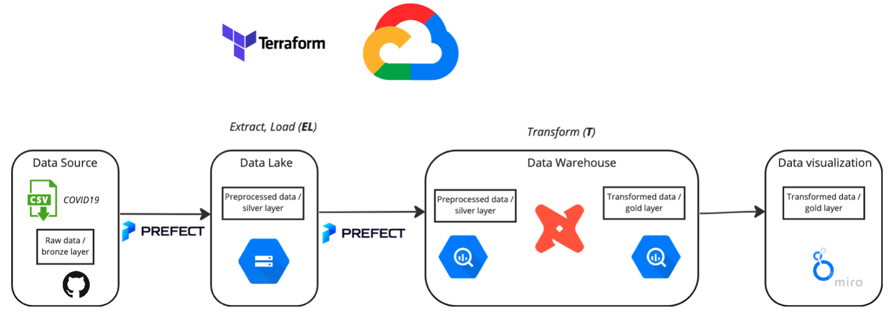

# covid19_monitoring
WIP Data pipeline for uploading, preprocessing, and visualising COVID19 data 



## Initial set up in Google Cloud Platform (GCP)

### *Step 1* Create a new project in GCP (in https://console.cloud.google.com/)

### *Step 2* Create and upload to GCP a ssh key to log in to the VM in GCP without typing a password

For Linix and MacOS: `ssh-keygen -t rsa -f ~/.ssh/KEY_FILENAME -C USERNAME -b 2048` (key is generated in ~/.ssh)

For Windows, look for more details here: [Create SSH Keys](https://cloud.google.com/compute/docs/connect/create-ssh-keys)

Next, copy and upload the public ssh key to GCP: Go to GCP -> Compute Engine -> Metadata -> SSH Keys -> Add SSH Key

### *Step 3* Create a virtual machine (VM) in GCP
  
  *3.1* Compute Engine -> VM instances -> enable Compute Engine API -> Create instance
  
  *3.2* In the creation process, choose:
  
  - the most suitable region for your location (europe-north1-a in my case)
  - E2, e2-standard-4 (4 vCPU, 16 GB memory) as series/machine type
  - Ubuntu 20.04 LTS, 30GB for Boot Disc

### (Optional) *Step 4* Configure instance

  *4.1* To simplify the process, it is suggested to install [Anaconda package management] (https://www.anaconda.com/products/distribution)

  Go to the bottom of the page and choose version for Linux, x86 architecture (that's what has been chosen for VM instance):

  ```sh
  wget https://repo.anaconda.com/archive/Anaconda3-2022.10-Linux-x86_64.sh

  bash Anaconda3-2022.10-Linux-x86_64.sh
  ```

  *4.2* Create config file on the PC to config access to the server (to avoid command to enter the VM)


  Create a file ~/.ssh/config:

  ```sh
  Host de-zoomcamp # name of the VM
        Hostname 35.228.114.109 # external IP of the VM
        User mikhail # user name which was used to generate the ssh key
        IdentityFile ~/.ssh/gcp # path to the ssh key. Note that it has to be absolute path for Windows
  ```

  Now it is possible to ssh to the VM by typing: `ssh de-zoomcamp` (otherwise it is: `ssh -i ~/.ssh/gcp de-zoomcamp`)

### *Step 5* Clone the repo

`git clone URL`

### *Step 6* Download Terraform 

[Link to Terraform](https://developer.hashicorp.com/terraform/downloads?product_intent=terraform)

Choose Linux/Ubuntu version (AMD64 architecture), copy the link, and download to the VM with ´wget´:

`wget https://releases.hashicorp.com/terraform/1.3.9/terraform_1.3.9_linux_amd64.zip`

Don't forget to unzip it next.

### *Step 7* GCP setup for Terraform

Service account has to be created for Terraform to give it the credentials to required services in GCP.

  *7.1* Go to GCP -> IAM & Admin -> Service Account -> Create Service Account
  *7.2* Follow the instructions and in the `Role` box choose `Viewer` and then choose `Done`
  *7.3* Actions -> Manage keys -> Create new key (JSON)
  *7.4* add export... CONTINUE FROM HERE
  
To add generated json file to the server, one can use `sftp`: 

```sh
sftp de-zoomcamp #connect to the server
mkdir .gc # create directory
put de_project.json # copy json file

