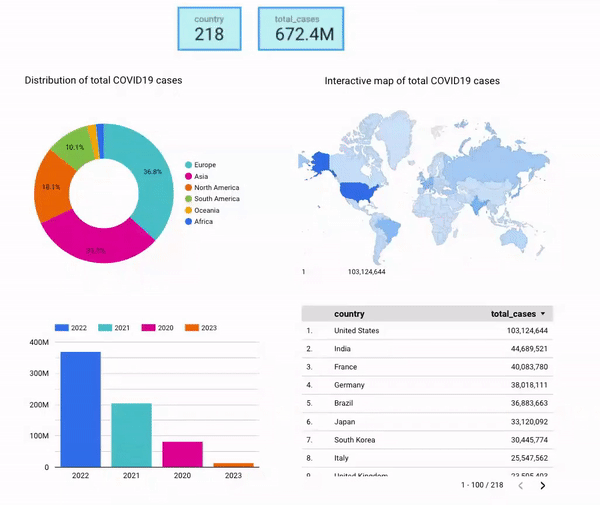
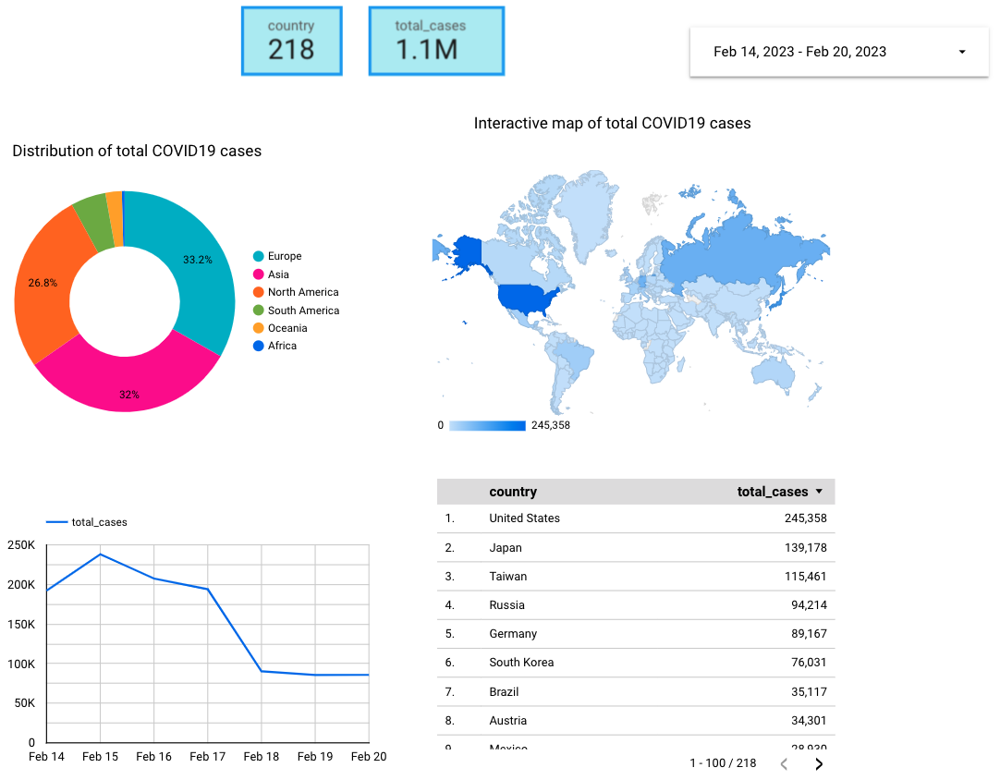
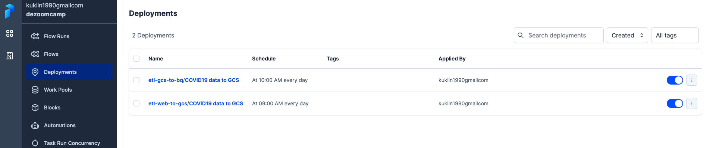
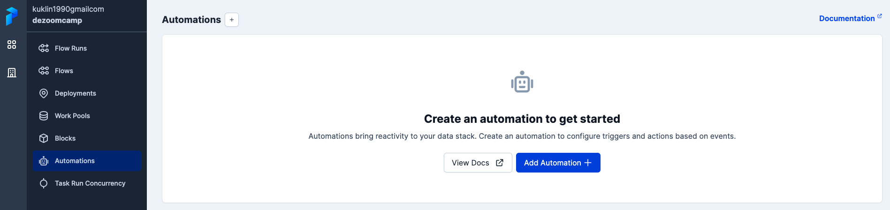

# Data pipeline for COVID19 monitoring

[](https://github.com/MikhailKuklin/data-pipeline-COVID19-monitoring/actions/workflows/GHA.yml)

**Data pipeline for uploading, preprocessing, and visualising COVID19 data using Google Cloud Platform**

This repo includes implementation of a pipeline for visualization of COVID19 data: all over the time and the last 7 days. 

Original idea of this pipeline is to have scheduled jobs with regularly updated table. 

Dashboard is available [here](https://lookerstudio.google.com/reporting/3aab8da6-770b-4877-96e1-e7db7f652e48). Note that it will not be update after April 2023.

Detailed description of the project without too deep focus on the tools is given in [the post on my personal page](https://mikhailkuklin.wordpress.com/data-pipeline-for-covid-19-data-dashboarding/).

>NOTE that starting from 08-03-2023, the data source of Our World in Data [has been changed](https://github.com/owid/covid-19-data/issues/2784) and the data is updated on weekly basis instead of daily (each Thu)




- [Goal](#Goal)
- [Content](#Content)
- [Data source](#Data-source)
- [Description of architecture](#Description-of-architecture)
- [Reproducibility](#Reproducibility)
- [Tests](#Tests)
- [Improvements](#Improvements)

## Goal

COVID19 has been affected our lives for quite long period of time already. It is important to regularly monitor the situation to avoid unexpected situations and be ready for actions beforehand. 

This project builds the pipeline which updates the dashboard for monitoring total cases of COVID19. The dashboard is daily updated so that it is easy to control the situation. The dashboard can be easily customized e.g. for the country, period of time, months, etc.

## Content

`/data`: [Data source](#Data-source)

`src/dbt`: dbt files and folders 

`/images`: printscreens for Readme files

`/infrastructure`: Terraform files

`/scripts`: helper scripts

`/src`: source codes

`env`: file with environmental variables

`/test`: [tests](#Tests) for the code

## Data source

Data has been provided by [Our World in Data](https://ourworldindata.org/coronavirus).

The source file has been uploaded from [GitHub](https://github.com/owid/covid-19-data) which was daily updated there until 08-03-2023 (the source was Johns Hopkins University). Johns Hopkins University stopped providing some metrics and the source was changed to the World Health Organization (WHO) from 08-03-2023. However, the data is updated on weekly basis (each Thu).

## Description of architecture


The source data (raw level) is originally in *csv* format and located in GitHub.

**Batch pipeline** is implemented using Google Cloud Platform (**GCP**). There is no point to implement stream pipeline as the data is not a real-time.

**Terraform** is used as an IaC (Infrastructure as code) to create resources in GCP.

Pipeline partially cleans the source `csv` data, saves it as a `parquet` file, and moves sequantially first to a datalake, GCP bucket (Google Cloud Storage (**GCS**)) and then to a data warehouse, **Google Biq Query** (silver layer). The whole process is orchestrated by **Prefect** as a **daily scheduled jobs**.

Pipeline follows so-called [medallion architecture](https://www.databricks.com/glossary/medallion-architecture) describing data as bronze, silver, and gold layers.

The silver layer data from the data warehouse is next transformed by **dbt** for configuring the schema, final cleaning, selecting only necessary columns, and saving the resulted data as tables to Big Query. The data is **partitioned** on the date as the date is later used for quering that optimizes the process. Because of the size of the data, the data was not clustered. This data (gold layer) is ready for the dashboard.

Dashboard has been built from the gold layer data using **Looker Studio** (previously Google Data Studio) which is synced with Big Query.

Unit tests `(/tests)`have been written and integrated into CI/CD pipelines via GitHub Actions. 

The implementation is limited by GCP usage. At the same time, implementation does not involve any local components which makes it more flexible for collaboration goals e.g. working in a team. 

## Reproducibility

1. One has to read with following instructions from [prerequisites_readme first](https://github.com/MikhailKuklin/covid19_monitoring/blob/main/prerequisites_readme.md).
This instruction gives a detailed step-by-step guidelines for required configurations of the tools and services needed for the pipeline.

2. On the virtual machine, run the following commands to deploy the pipelines:

```sh
cd src/
prefect cloud login # or ´prefect orion start` if you don't have or don't want to create an account
prefect deployment build web_to_gcs.py:web_to_gcs -n 'COVID19 data to GCS' --cron "0 9 * * *" -a # creates deployment yaml file and schedule it via CRON on 9 UTC time every day
prefect deployment build gcs_to_bq.py:gcs_to_bq -n 'COVID19 data to BQ' --cron "0 10 * * *" -a # creates deployment yaml file and schedule it via CRON on 10 UTC time every day
tmux # it will allow to run prefect agent in the background when ssh connection will be closed
prefect agent start -q 'default'
```



3. Deploy dbt core job for data transformation to Prefect and update:

```sh
cd src/
source ../env
prefect deployment build run-dbt.py:dbt_transform -n 'dbt job' --cron "0 11 * * *" -a # # creates deployment yaml file and schedule it via CRON on 11 UTC time every day
```

This job will update gold layer table in Big Query with daily data.

4. Follow configuring instructions for [Looker Studio](https://github.com/MikhailKuklin/covid19_monitoring/blob/main/visualizations_readme.md)

Final dashboard is located [here](https://lookerstudio.google.com/reporting/3aab8da6-770b-4877-96e1-e7db7f652e48) with `Viewer` mode. Dashboard contains two pages for COVID19 visualizations: all over the time and the last 7 days. 

If one want to reuse the dashboards, the copy with `Editor` mode for public is located at [this link](https://lookerstudio.google.com/reporting/e9453200-efb9-409b-8c6f-d5eda5e091af). Please, create the copy of this dashboard in order to avoid direct changes in the file.

## Tests

Two different kind of tests have been developed:

(1) checking dataframe schema inside of Prefect flow

(2) checking the consistency of the functions in the ´/src´ which are critical for running the pipeline.

Tests (2) are integrated to CI/CD pipeline using GitHub Actions.

## Improvements

- Dashboard can be modified by adding ´total cases per million´ metrics instead of ´total cases´ which is a normalization for easier comparison between countries.

- Due to the nature of the source dataset, the current implementation every time copies the full file. It is not the ideal case because data lake and data warehouse already contain most of the data and only recent data has to be added. It is not a problem for this project because the size of the data is not huge, but in general, it is not a good practice.

- Within pipelines, there is a risk that one of the steps might fail and running other steps could be meaningless or sometimes even harmful. Ideally, steps in pipeline should be triggered based on the success of the previous one instead of the scheduled runs. Such triggers might be easily implemented in Prefect using ´Automations´ feature. However, because the pipeline is not complex and easy to debug, triggers automation can be avoided for now.


