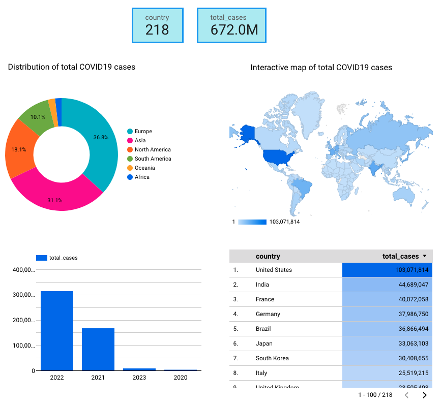
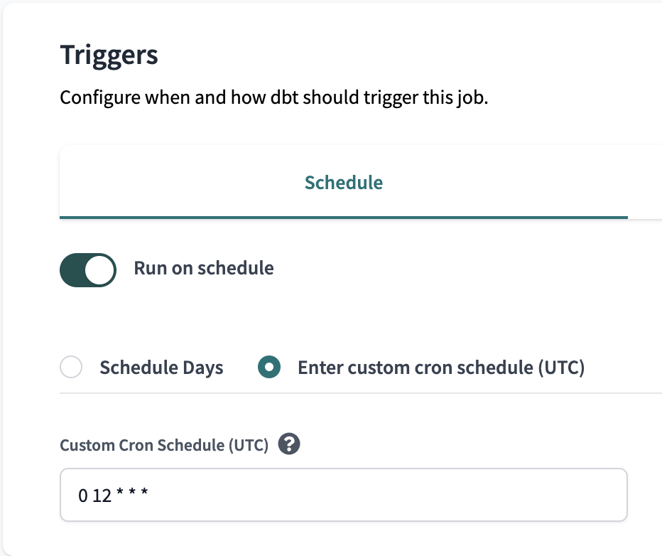

# covid19_monitoring


Data pipeline for uploading, preprocessing, and visualising COVID19 data 

This repo includes implementation of a pipeline for visualization of COVID19 data. Original idea of this pipeline is to have scheduled jobs with regularly updated table. 

[](https://youtu.be/Clw7le3x8zQ)


- [Goal](#Goal)
- [Content](#Content)
- [Data source](#Data-source)
- [Description of architecture](#Description-of-architecture)
- [Reproducibility](#Reproducibility)
- [Improvements](#Improvements)

## Goal

COVID19 has been affected our lives for quite long period of time already. It is important to regularly monitor the situation to avoid unexpected situations and be ready for actions beforehand. 

This project builds the pipeline which updates the dashboard for monitoring total cases of COVID19. The dashboard is daily updated so that it is easy to control the situation. The dashboard can be easily customized e.g. for the country, period of time, months, etc.

## Content

`/data`: [Data source](#Data-source)

`/dbt`: dbt files and folders 

`/images`: printscreens for Readme files

`/infrastructure`: Terraform files

`/scripts`: helper scripts

`/src`: source codes

`/test`: tests for the code

## Data source

Data has been provided by [Our World in Data](https://ourworldindata.org/coronavirus).

The source file has been uploaded from [GitHub](https://github.com/owid/covid-19-data) which is daily updated there.

## Description of architecture


The source data (raw level) is originally in *csv* format and located in GitHub.

**Batch pipeline** is implemented using Google Cloud Platform (**GCP**). There is no point to implement stream pipeline as the data is not a real-time.

**Terraform** is used as a IaC (Infrastructure as code) to create resources in GCP.

Pipeline partially cleans the source `csv` data, saves it as a `parquet` file, and moved sequantially first to a datalake, GCP bucket (Google Cloud Storage (**GCS**)) and then to a data warehouse, **Google Biq Query** (silver layer). The whole process is orchestrated by **Prefect**.

The silver layer data from the data warehouse is next transformed by **dbt** for configuring the schema, final cleaning, and saving the resulted data as a table to Big Query. The data is **partitioned** on the date as the date is later used for quering that optimizes the process. Because of the size of the data, the data was not clustered. This data (gold layer) is ready for the dashboard.

Dashboard has been built from the gold layer data using **Looker Studio** (previously Google Data Studio) which is synced with Big Query.

Unit tests `(/tests)`have been written and integrated into CI/CD pipelines via GitHub Actions. 

The implementation is limited by GCP usage. At the same time, implementation does not involve any local components which makes it more flexible for collaboration goals e.g. working in a team. 

## Reproducibility

1. One has to read with following instructions from [prerequisites_readme first](https://github.com/MikhailKuklin/covid19_monitoring/blob/main/prerequisites_readme.md).
This instruction gives a detailed step-by-step guidelines for required configurations of the tools and services needed for the pipeline.

2. Clone this repo to the VM

3. Go to `infrastructure` folder and run:

```sh
terraform init
terraform plan
terraform apply
```

Terraform will create required resources in GCP.

4. Copy the data from the source to GCP, preprocess it, and copy next to BQ using Prefect

```sh
conda activate covid19
prefect cloud login # or ´prefect orion start` if you don't have or don't want to create an account
prefect deployment build src/web_to_gcs.py:web_to_gcs -n 'COVID19 data to GCS' --cron "0 9 * * *" -a # creates deployment yaml file and schedule it via CRON on 9 UTC time every day
prefect deployment build gcs_to_bq.py:gcs_to_bq -n 'COVID19 data to BQ' --cron "0 10 * * *" -a # creates deployment yaml file and schedule it via CRON on 10 UTC time every day
tmux # it will allow to run prefect agent in the background when ssh connection will be closed
prefect agent start -q 'default'
```


5. After that, go to dbt cloud and follow the steps for dbt setup steps from [prerequisites_readme](https://github.com/MikhailKuklin/covid19_monitoring/blob/main/prerequisites_readme.md)). Initialize the project. Next, in order to schedule a daily job, one has to first create **Environment**:

In dbt Cloud UI, choose Deploy -> Environments:


Next, choose Deploy -> Jobs:




Note that two threads are used as two models are run. Cron job is scheduled at 12.00 UTC time every day.

This job will update gold layer table in Big Query with daily data.

6. Follow first configuring instructions for [Looker Studio](https://github.com/MikhailKuklin/covid19_monitoring/blob/main/visualizations_readme.md)

Final dashboard is located here with `Viewer` mode. To get more detailed information on implementation of the dashboard, get detailed look at the copy of the production dashboard which the `Editor` mode.

## Improvements

Due to the nature of the source dataset, the current implementation every time copies the full file. It is not the ideal case because data lake and data warehouse already contain most of the data and only recent data has to be added. It is not a problem for this project because the size of the data is not huge, but in general, it is not a good practice.
